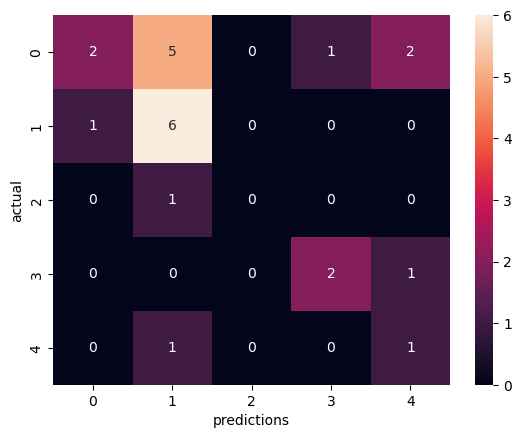

# CST383_Project: Can a dog's attributes predict their intelligence?
<p align="center">

</p>


CST383: Introduction to Data Science

Professor Ergezer

Kevin Mcnulty, Nadia Rahbany, Juli Shinozuka, Andrew Shiraki

02/25/2023
  
## Introduction

Have you ever wondered if there are attributes that can help predict intelligence in a companion dog? What we hope to discover is whether attributes like height, weight, demeanor, and energy level can indicate a dog's intelligence level. Intelligence (or obedience) is the likelihood that a dog will obey commands and require fewer repititions to learn new commands. The intelligence scoring does not take into account that some dogs are bred for tasks that does not require 'obedience' to humans and rely more on independent thinking to do their purpose.<br><br> 

## Selection of Data
  
The project included 2 initial datasets and an additonal dataset for added features.  These datasets were merged and cleaned.  The resulting dataset had 113 entries of AKC dog breeds and 15 features.<br><br>
The data processing and cleaning included:
-   the removal of features not needed
-   the creation of features by combining other features
-   fixing spellings of dog breeds (using the AKC website as the source for correct data)
-   fixing anomalies with correct values (using the AKC website as the source for correct data)

Source of the CSV files:

-   [Kaggle - Canine Intelligence and Size](https://www.kaggle.com/datasets/thedevastator/canine-intelligence-and-size?select=AKC+Breed+Info.csv) on Jan 31, 2023 (6pm)
-   [Github - akcdata by tmfilho](https://github.com/tmfilho/akcdata) on Feb 4, 2023 (5pm)

Some errors were found in the dataset and were replaced with correct data from the AKC website.
-   [AKC website link](https://www.akc.org) where corrected data came from. (Feb 14, 2023)

The merged dataset (dd) features:
-   'Breed' - Name of AKC dog breed. (string)
-   'height_low_inches' - The lower range of dog's height. (float)
-   'height_high_inches' - The upper range of a dog's height. (float)
-   'weight_low_lbs' - The lower range of dog's weight. (float)
-   'weight_high_lbs' - The upper range of dog's weight. (float)
-   'Classification' - The size calculation of the dog according to AKC. (string)
-   'obey' - The probability that the breed obeys the first command. (float)
-   'reps_lower' - The lower limit of repetitions to understand a new command. (int)
-   'reps_upper' - The upper limit of repetitions to understand a new command. (int)
-   'group' - The AKC group the breed is in. (string)
-   'energy_level_value' - A number representing the breed's energy level. (float)
-   'demeanor_value' - A number representing the breed's reaction to strangers and other pets. (float)
-   'weight_avg' - The average of lower and upper range of dog's weight.
-   'height_avg' - The average of lower and upper range of dog's height.
-   'reps_avg' - The average of lower and upper range of dog's repetitions to understand a new command.  (float)
-   'height_to_weight' - The height_avg / weight_avg.  (float)

**NOTE**: 'Classification', 'obey' and all the 'reps' columns show the same information in different ways.  One should only be used as the target and not also a feature.

## Methods

Tools:
-   Numpy, Pandas, Matplotlib, Seaborn, and GraphViz for data analysis and visualization
-   Scikit-learn for building several machine learning models 
-   Anaconda's Jupyter Notebook and Sypder for individual work
-   Google Collab for group collaboration on project code
 
Methods used with Scikit and SciPy:
-   Models: kNeighborClassfier, KNeighborsRegressor, LinearRegression, PolynomialFeatures, DecisionTreeClassifier
-   Other: StandardScaler, zscore, confusion_matrix

## kNN Classification Model




Target: 
- `Classification`

Predictors:
- `energy_level_value`
- `demeanor_value`
- `height_avg`
- `weight_avg`

The highes accuracy achieved by the kNN classifier model was 48% with an n value of 5. 

## kNN Regression Model


Target: 
- `obey`

Predictors:
- `energy_level_value`
- `demeanor_value`
- `height_avg`
- `weight_avg`

The data set placed numerical value on each `Classification` which allows use of the kNN regression model. The kNN Regression model, simliarly to the classifier model, performed the best at $n=5$ with an RMSE value of 19.67, which is worse than the baseline RMSE value of 19.04

## Linear Regression Model


Target: 
- `obey`

Features:
- `energy_level_value`
- `demeanor_value`
- `height_avg`
- `weight_avg`

Linear regression model performed worse than kNN regression model. As many of the datapoints in this dataset are vertically stacked, the linear regression model is not well suited for this application.

## Decision Tree Classifier


Target: 
- `Classification`

Predictors:
- `energy_level_value`
- `demeanor_value`
- `height_avg`
- `weight_avg`

The Decision Tree Classifier model performed the best at a  tree depth of 2 with an accuracy of about 30% Accuracy. 
Suspect that this is due to simply limiting the number of buckets which the classifier can sort datapoints into. 

## Discussion

The findings of this project suggest that the attributes of a dog are not strongly correlated with its intelligence, at least not in a way that can be accurately predicted with the small dataset used. These results highlight the importance of larger and more diverse datasets for machine learning models to be effective.
In this case, the small size and limited scope of the dataset likely limited the effectiveness of the models used and because of that it is difficult to draw any firm conclusions about the relationship between dog attributes and intelligence, and further research is needed to explore this topic in more depth. Moving forward, it will be important for researchers to carefully consider the quality and size of their datasets when choosing machine learning tools and techniques for analyzing data.

## Summary

This project aimed to investigate whether various attributes of a dog could be used to predict its level of intelligence. The project used a dataset consisting of 113 out of over 200 dog breeds in the AKC and 15 features, including height, weight, energy level, and demeanor. The data was cleaned and processed to correct errors and inconsistencies, and the resulting dataset was used to train and test several machine learning models.

To explore the data further, we applied several machine learning models, including k-Nearest Neighbors, Linear Regression, Polynomial Regression, and Decision Trees. However, the models did not produce satisfactory results, indicating that the dataset may not be large enough, and the features may not be sufficient to predict a dog's intelligence accurately.

Despite the lack of a significant correlation, the project was still an interesting exploration of the data. The project highlights the importance of having clean and consistent data when working with machine learning models. The project could be expanded in the future by incorporating additional data sources, such as data on mixed breed dogs, and specific enviornmental and training factors. 


```
 ____________
< Thank You! >
 ------------
   \
    \
               |    .
           .   |L  /|
       _ . |\ _| \--+._/| .
      / ||\| Y J  )   / |/| ./
     J  |)'( |        ` F`.'/
   -<|  F         __     .-<
     | /       .-'. `.  /-. L___
     J \      <    \  | | O\|.-'
   _J \  .-    \/ O | | \  |F
  '-F  -<_.     \   .-'  `-' L__
 __J  _   _.     >-'  )._.   |-'
 `-|.'   /_.           \_|   F
   /.-   .                _.<
  /'    /.'             .'  `\
   /L  /'   |/      _.-'-\
  /'J       ___.---'\|
    |\  .--' V  | `. `
    |/`. `-.     `._)
       / .-.\
       \ (  `\
        `.\

```
